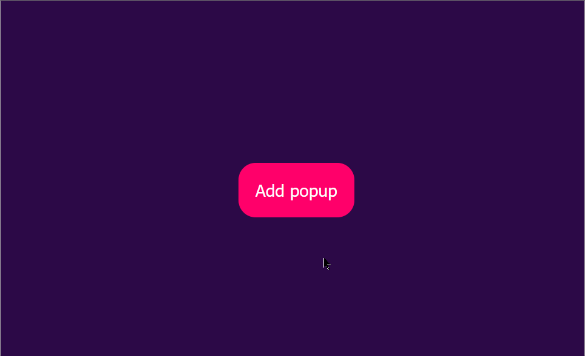

<h1 align="center"><strong>use-animate-presence</strong></h1>
<p align="center"></p>
<p align="center" style="font-size: 18px"><strong>A React hook for animating components when they are mounted and unmounted (added to / removed from React tree).</strong></p>

# Features:

- Uses Web Animation API (60fps animation off main thread)
- Spring physics based animation
- Cancelable / reversable animations
- Chainable mounts / unmounts
- Small (~1KB)

# Demo

[](https://codesandbox.io/s/use-animate-presence-logo-vxdqc?fontsize=14&hidenavigation=1&theme=dark)

# Get started

- NPM: `npm install use-animation-presence`
- UMD: https://unpkg.com/use-animate-presence@latest/lib/use-animate-presence.umd.js

# Basic usage

```jsx
import { useAnimatePresence } from "use-animate-presence";

const variants = {
  x: { from: -800, to: 0 },
};

export default function App() {
  const animatedDiv = useAnimatePresence({
    variants,
    initial: "visible",
  });

  return (
    <div>
      <button onClick={() => animatedDiv.togglePresence()}>Toggle</button>
      {animatedDiv.isRendered && <div ref={animatedDiv.ref} />}
    </div>
  );
}
```

Play with the code here:

[](https://codesandbox.io/s/use-animate-presence-basic-demo-fpwy0?fontsize=14&hidenavigation=1&theme=dark)

# Advanced usage

`useAnimatePresence` takes one object as an argument. Below is a table with possible properties and their description (some properties are explained in detail later):

|       Property       |   Default    | Required |          Type          |                                 Details                                 |
| :------------------: | :----------: | :------: | :--------------------: | :---------------------------------------------------------------------: |
|      `variants`      |      -       |  `true`  |        `object`        |                    Properties and values to animate                     |
|      `initial`       |      -       |  `true`  | `"hidden" | "visible"` |                   Whether item is rendered initially                    |
| `animateFirstRender` |    `true`    | `false`  |       `boolean`        |            Whether to animate on first render (first mount)             |
|       `enter`        | `undefined`  | `false`  |       `function`       |          Function to execute when enter animation is finished           |
|        `exit`        | `undefined`  | `false`  |       `function`       |           Function to execute when exit animation is finished           |
|        `wait`        | `undefined`  | `false`  |       `function`       | Function to execute both when enter and when exit animation is finished |
|     `debugName`      | `"unknown"`  | `false`  |        `string`        |          Name for tracking the animation lifecycle of the hook          |
|      `duration`      |    `1000`    | `false`  |        `number`        |        Animation duration (ms) (use if you only animate opacity)        |
|      `options`       | (read below) | `false`  |        `object`        |           Spring options (stiffness, mass and damping ratio)            |

## Return value

`useAnimatePresence` returns an object which contains a function that can toggle presence, a ref that you need to attach to the element you want to animate and a `isRendered` property which you can use to conditionally render elements.

|     Property     |                           Details                            |
| :--------------: | :----------------------------------------------------------: |
|      `ref`       |                         React `ref`                          |
| `togglePresence` |        Function that toggles presence (and animates)         |
|   `isRendered`   | Boolean that should be used to conditionally render elements |

Look again at the example above to see how all properties are used:

```javascript
return (
  <div>
    <button onClick={() => animatedDiv.togglePresence()}>Toggle</button>
    {animatedDiv.isRendered && <div ref={animatedDiv.ref} />}
  </div>
);
```

## Variants

Variants look like this:

```javascript
const variants = {
  x: { from: -800, to: 0 },
  deg: 360,
};
```

Except for `deg`, which is degrees of rotation, every property must have a `from` value and a `to` value. All possible properties are: `x`, `y`, `deg`, `opacity` and `scale` (`scale` is experimental and might not work as intended).

## `enter`, `exit` and `wait`

These are callbacks to be executed after `enter` (mount) or `exit` (unmount) animation finishes. `wait` is simply a shorthand - if you need to execute the same callback on both `enter` and `exit` animations you can just pass it as a `wait` property. Mostly, you will need this to chain mounts / unmounts. For example, if you want element B to animate only after element A is finished, you can do this:

```javascript
const elementA = useAnimatePresence({
  variants: springVariants,
  initial: "hidden",
  debugName: "front-square",
});

const elementB = useAnimatePresence({
  variants: springVariants,
  initial: "visible",
  wait: elementA.togglePresence,
});

return (
  <>
    {<button onClick={() => elementB.togglePresence()}>Toggle</button>}
    {elementB.isRendered && (
      <div ref={elementB.ref}>
        {elementA.isRendered && <div ref={elementA.ref} />}
      </div>
    )}
  </>
);
```

In this example, `elementA` will not be animated and its property `isRendered` will be false until `elementB` is finished animating. Play with a complex example here:

[](https://codesandbox.io/s/use-animate-presence-demo-cfn8b?fontsize=14&hidenavigation=1&theme=dark)

## Spring options

Springs have stiffness, mass and damping ratio. The defaults are: stiffness `150`, mass `3` and damping `27`. You can customize the parameters like this:

```javascript
useAnimatePresence({
  variants,
  initial: "visible",
  options: {
    stiffness: 500,
    mass: 1,
    damping: 10,
  },
});
```

# Recipes

## Popup notifications

You can easily create nice popup notifications with this library.



Example:

[](https://codesandbox.io/s/animate-popup-ww83f?fontsize=14&hidenavigation=1&theme=dark)

# Requirements

This library requires React version 16.8.0 or higher (the one with Hooks).

# Contribution

Any kind of contribution is welcome!

1. Open an issue or pick an existing one that you want to work on
2. Fork this repository
3. Clone your fork to work on it locally
4. Make changes
5. Run `yarn build` and make sure that it builds without crash
6. Push changes and [open a pull request](https://docs.github.com/en/github/collaborating-with-issues-and-pull-requests/creating-a-pull-request)

Note: if you want to link the package to some other project to do integration tests, you may run into an issue with two React versions. In this case, run `npm link <path-to-react-in-your-other-project>` while in `use-animation-presence` root directory.
